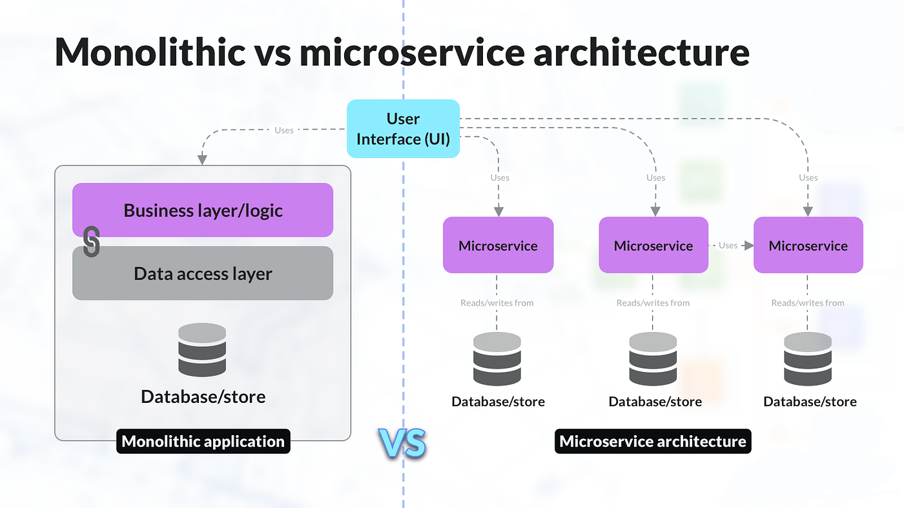
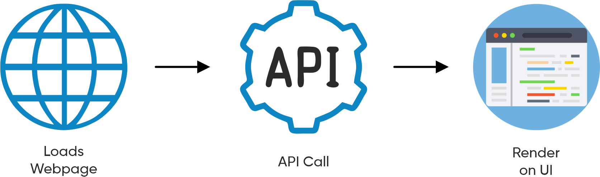
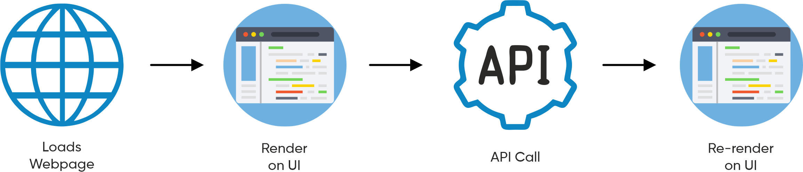
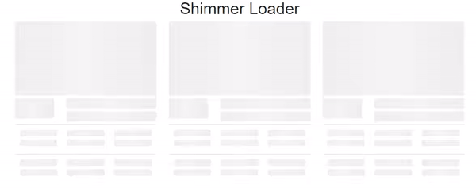

# Chapter 06 - Exploring the world

### Que. Explain `Monolithic and Microservice Architecture`.

### `Monolithic Architecture:`
- ### Monolith is a `single, unified unit` where the entire application is built and deployed as a single piece of software.
- ### Components and modules in a monolith are tightly integrated, often sharing the `same codebase and database`.
- ### Scaling a monolith involves replicating the entire application, which can be resource-intensive and challenging.
- ### Development, testing, and deployment are done as a whole, making it simpler to manage but potentially slower.
- ### Monoliths `typically use a single technology stack` for the entire application.
- ### Debugging can be relatively easier as all components are in one place.

### `Microservice Architecture:`
- ### Microservices `break down the application into small, independent services`, each responsible for specific business capabilities.
- ### Services in a microservices architecture are loosely coupled, allowing them to be developed, deployed, and scaled independently.
- ### Scaling is more flexible, as only the services that require additional resources can be scaled independently.
- ### Each microservice can be developed, tested, and deployed independently, enabling faster release cycles.
- ### Different `services can use different technology stacks` based on their specific requirements. This is also known `Seperation of Concerns`.
- ### Debugging and tracing issues might be more complex as they involve interactions between distributed services.



---

### Que. How does the `UI fetch data from the backend`?
### There are two Approaches to fetch data from the backend:
1. ### `Load Webpage -> API Call -> Render on UI:`
    

     - ### In this approach, the `webpage initially loads`, and then an API (Application Programming Interface) call is made to the backend.
     - ### The `API call` requests specific data or resources from the backend server.
     - ### Once the backend processes the request and returns the data, the `UI is then updated or rendered` with the received information.
     - ### This approach is straightforward and is commonly used in many web applications.

    ---

2. ### `Load Webpage -> Render on UI (Shimmer UI) -> API Call -> Re-render on UI:`
    
     
     - ### In this approach, the `webpage loads` and renders a placeholder or `Shimmer UI` to provide a visual indication to the user that content is loading.    
     - ### The `UI is rendered initially with some generic or loading state components` while waiting for the data from the backend.
     - ### Subsequently, an `API call is made to fetch the actual data` from the backend.
     - ### Once the data is retrieved, the `UI is re-rendered, replacing the placeholder or loading state` with the actual content.
     - ### This approach helps improve user experience by providing immediate feedback that something is happening, even before the actual data is available.

---

### Que. What is `useEffect` Hook? [📄Documentation](https://www.w3schools.com/react/react_useeffect.asp)
- ### useEffect is a React hook used for `handling side effects in functional components`.
- ### Side effects are operations or tasks that happen outside the normal flow of a function, such as data fetching, subscriptions, or manually changing the DOM.
- ### useEffect `runs after the component renders`.
- ### By importing `useEffect` from the react library, you gain access to this hook.
    ### Importing useEffect:
    ```js
    import { useEffect } from "react";
    ```
- ### Using `useEffect` in the Code:
    1. ### No dependency passed:
        ```js
        useEffect(() => {
            //Runs on every render
        });
        ```

    2. ### An empty array:
        ```js
        useEffect(() => {
            //Runs only on the first render
        }, []);
        ```

    3. ### Props or state values:
        ```js
          useEffect(() => {
            //Runs on the first render
            //And any time any dependency value changes
          }, [prop, state]);
        ```

- ### It takes `two parameters`: a function containing the code for the side effect, and an optional dependency array.
    ```js
    useEffect(() => {
        //Runs only on the first render
    }, []);
    ```
    - ### The function inside useEffect is the `callback function` runs after UI or Component render.
    - ### If the dependency array is empty (`[]`), the effect runs only once after the initial render.
    - ### If `dependencies are specified`, the effect runs whenever any of the dependencies change.

    ---

- ### Why `useEffect` in My Code?
    ```js
    useEffect(() => {
        fetchData();
    }, []);
    ```
    ### `useEffect` is used to initiate a side effect, specifically fetching data from an API `fetchData()` function when the component mounts.
    ### The empty dependency array (`[]`) ensures it runs only once after the initial render.

    ---

- ### Why do we need useEffect Hook?
    - ### `Handling Side Effects:`
        ### `useEffect` manages side effects in functional components, such as data fetching or changing the DOM.
    
    - ### `After Rendering:`
        ### It runs after our component shows up, so we can do things after it appears on the screen.

    - ### `Dependency Tracking:`
        ### Configurable with a dependency array, useEffect re-executes when dependencies change, synchronizing with component state and props.
    
    - ### `Preventing Infinite Loops:`
        ### It also helps us avoid situations where our component keeps redoing the same thing over and over.

---

### Que. What is `CORS`?
- ### CORS stands for `Cross-Origin Resource Sharing`.
- ### CORS is a security mechanism that allows or `restricts web applications` running at one origin (domain) `to make requests` for resources `from a different origin`.
- ### Browsers, by default, follow the `Same-Origin Policy`, preventing web pages from making requests to a different domain than the one that served the web page.
- ### CORS is implemented through HTTP headers, including the `Origin` header sent by the browser and the `Access-Control-Allow-Origin` header sent by the server to specify allowed origins.
- ### CORS helps prevent unauthorized cross-origin requests, adding a security layer by allowing servers to define which domains can access their resources, thus protecting sensitive data and services.

- ### To allow CORS requests install the following extension - [Link](https://chromewebstore.google.com/detail/allow-cors-access-control/lhobafahddgcelffkeicbaginigeejlf)
    ```
    Allow CORS: Access-Control-Allow-Origin
    ```

---

### Que. What is `Optional Chaining`?
- ### It is simplifies code by providing a concise way to access nested properties or methods, `handling potential null or undefined values`.
- ### Use the question mark (?) after an object or array to safely access nested properties or methods without causing `Cannot read property errors`.
    ### Example:
    ```js
    let liveData = data?.data?.cards[1]?.card?.card?.gridElements?.infoWithStyle?.restaurants;
    ```
- ### Enhances code readability by reducing the need for verbose conditional checks, especially when dealing with external data or APIs where certain properties may be missing.

---

### Que. What is `Shimmer UI`?
- ### It is a `visual placeholder technique` used in user interfaces during data loading. It presents a `subtle animation`, often a moving gradient, to `indicate that content is being fetched`.
- ### Designed to provide immediate feedback to users while waiting for data, preventing a blank or static screen and giving the impression that something is happening in the background.
- ### Improves the perceived performance of an application by creating a more interactive and responsive feel, offering a smooth transition from a loading state to displaying actual content.
    ### Example:
    

---

### Que. What is `Conditional Rendering`? explain with a code example.
- ### It is a technique in programming where the display of `elements or components is determined by a certain condition` or set of conditions.
- ### In React, for instance, you might conditionally render a component based on a variable:
    ### Example:
    ```js
    {isLoggedIn ? <WelcomeComponent /> : <LoginComponent />}
    ```
    ### Here, `WelcomeComponent` is rendered if `isLoggedIn` is true, otherwise `LoginComponent` is rendered.

---

### > [SwigZo Application Live 🚀](https://react-chapter6.vercel.app/)